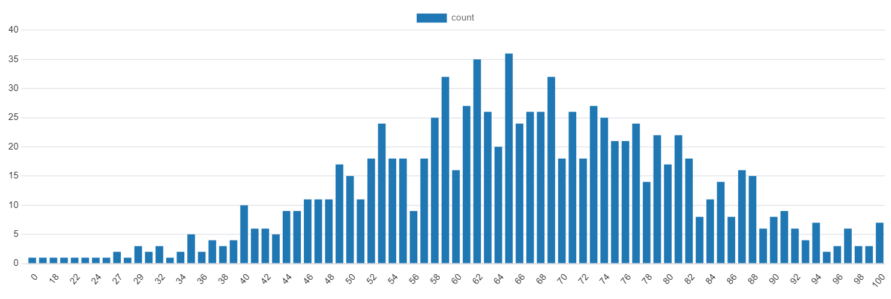
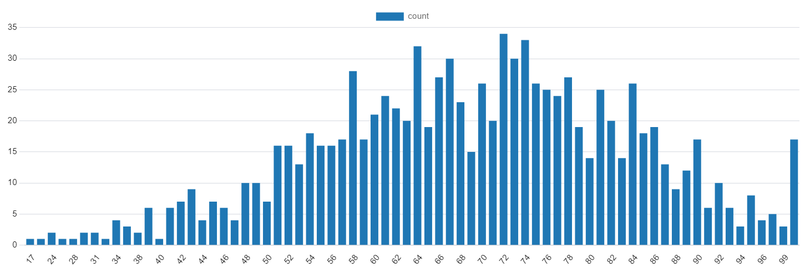
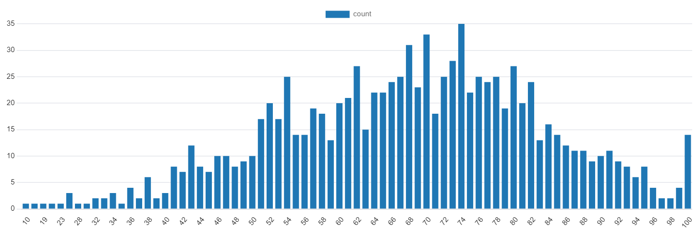
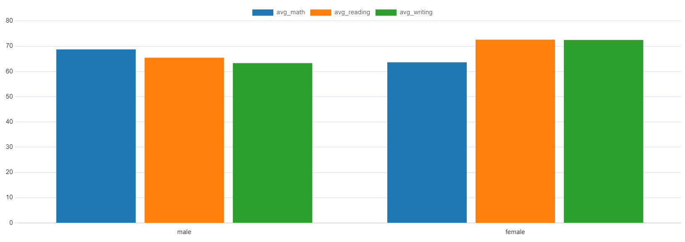
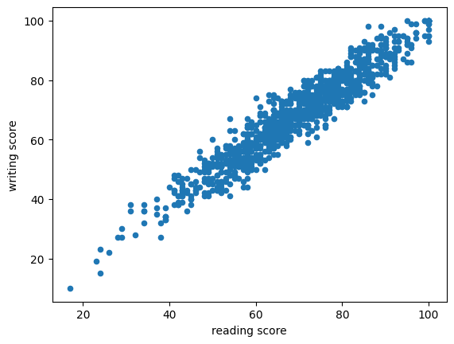

<h1 align="center" style="color:White">EXAM SCORES</h1>

------
<h3 align="center" style="color:White">INTRODUCTION </h3>

------
 
 <h4 align="center" style="color:White">About Dataset </h4

The dataset Students Performance in Exams is taken from the platform [Kaggle](https://www.kaggle.com/datasets/spscientist/students-performance-in-exams/data). 

**Context**

Marks secured by the students

**Content**

This data set consists of the marks secured by the students in various subjects.

**Acknowledgements**

http://roycekimmons.com/tools/generated_data/exams

**Inspiration**

To understand the influence of the parents background, test preparation etc on students performance


<h4 align="center" style="color:White">About Research </h4>

This study has **three Research Questions**:
  1. *Which exam is the hardest?*

  2. *Male or female?*
  
  1. *How effective is the test preparation course?*

  2. *Which major factors contribute to test outcomes?*

  3. *What would be the best way to improve student scores on each test?*

 In this study you will see all the **steps**:

 1. *Data cleaning*

 2. *Data analysis*

 3. *Conclusions*

 ------

<h3 align="center" style="color:White">Data Cleaning </h3>

 ------

<h4 align="center" style="color:White">About data cleanliness</h4

This dataset is completely clean. There are no NULL values or values that contradict the logic. For example in the columns **math score**, **reading score**, **writing score** there are no values that exceed 100 or are negative. So we were relieved of important work.

<h6 align="center" style="color:White">math score</h6>

<p align="center">

</<p align="center">

<h6 align="center" style="color:White">reading score</h6>

<p align="center">

</<p align="center">


<h6 align="center" style="color:White">writing score</h6>


<p align="center">

</<p align="center">

---

<h3 align="center" style="color:White">Data Analysis</h3

---
---

<h4 align="center" style="color:White">Which exam is the hardest?</h4

Logically speaking, it's a math exam. Let's see if that's actually true. 

``` sql
SELECT ROUND(AVG(math_score),
		2) AS avg_math,
		ROUND(AVG(reading_score),
		2) AS avg_reading,
		ROUND(AVG(writing_score),
		2) AS avg_writing
FROM students 
```

|avg_math  |avg_reading| avg_writing |
|----------|-----------|-------------|
66.09	   |       69.17|	    68.05|

Apparently he is. **The math exam is the hardest**, followed by the writing exam and the easiest is the reading exam.

<h4 align="center" style="color:White">Male or female?</h4

Now look who's doing better on which exams. 

```sql
SELECT gender,
		ROUND(AVG(math_score),
		2) AS avg_math,
		ROUND(AVG(reading_score),
		2) AS avg_reading,
		ROUND(AVG(writing_score),
		2) AS avg_writing
FROM students
GROUP BY  gender 
```

|gender	|avg_math	|avg_reading|	avg_writing|
|----------|-----------|-------------|---------------|
|male|	  68.73|	65.47|	63.31|
|female|	63.63|	72.61|	72.47|

As we see women do much better on exams like wirting and reading, and men do much better on math

<p align="center">

</<p align="center">

<h4 align="center" style="color:White">How effective is the test preparation course?</h4

Let's see how useful the course has been in preparing for the exam for students 

```sql
SELECT test_preparation_course,
		ROUND(AVG(math_score),
		2) AS avg_math,
		ROUND(AVG(reading_score),
		2) AS avg_reading,
		ROUND(AVG(writing_score),
		2) AS avg_writing
FROM students
GROUP BY  test_preparation_course
```
|test_preparation_course|avg_math|avg_reading|avg_writing|
|----------|-----------|-------------|---------------|
|none|	64.08|	66.53|	64.50|
|completed|	69.70|	73.89|	74.42|

Look at this! The courses for exam preparation proved to be quite effective. Students who took the preparation courses did **8.77%** better in math, **11.06%** better in reading, and **15.38%** better in writing. 

How effective is the test preparation course? Definitely yes. Courses to prepare for the exam have shown their effectiveness.

<h4 align="center" style="color:White">Which major factors contribute to test outcomes?</h4

Let's analyze how race, parental education, and lunch(standard or free/reduced) affect test scores. To do this, we need to write three queries

-

```sql
SELECT race_ethnicity,
		ROUND(AVG(math_score),
		2) AS avg_math,
		ROUND(AVG(reading_score),
		2) AS avg_reading,
		ROUND(AVG(writing_score),
		2) AS avg_writing
FROM students
GROUP BY  race_ethnicity
ORDER BY  race_ethnicity
```

|race_ethnicity|	avg_math|	avg_reading|	avg_writing|
|----------|-----------|-------------|---------------|
|group A|	61.63|	64.67|	62.67|
|group B|	63.45|	67.35|	65.60|
|group C|	64.46|	69.10|	67.83|
|group D|	67.36|	70.03|	70.15|
|group E|	73.82|	73.03|	71.41|

As we can see **group E passes the best exams in all subjects**, and group A on the contrary is the worst and passes exams much worse in all subjects 

But let's not jump to conclusions and say that group E is just better than everyone else and very smart. Let's take a look at how many percent of each group took courses to prepare for the exams. Maybe that's it?

```sql
SELECT race_ethnicity,
		 ROUND(COUNT(*) FILTER(WHERE test_preparation_course = 'completed')::DECIMAL
         / COUNT(*) * 100,2) AS completed
FROM students
GROUP BY  race_ethnicity
ORDER BY  race_ethnicity
```

|race_ethnicity|	course_completed|
|-|-|
|group A|	34.83
|group B|	35.79
|group C|	36.68
|group D|	31.30
|group E|	42.86

It is true that Group E did best in the exams because a large number of students took exam preparation courses 

-

Now let's see how parents' education affects their children's exam results 


```sql
SELECT parental_level_of_education,
		 ROUND(AVG(math_score),
		2) AS avg_math,
		 ROUND(AVG(reading_score),
		2) AS avg_reading,
		ROUND(AVG(writing_score),
		2) AS avg_writing,
		 ROUND(COUNT(*) FILTER(WHERE test_preparation_course = 'completed')::DECIMAL / COUNT(*) * 100,2) AS completed
FROM students
GROUP BY  parental_level_of_education
ORDER BY  parental_level_of_education
```

| parental_level_of_education | avg_math | avg_reading| avg_writing| completed |
|-------------------------------|------------|---------------|---------------|-------------|
| associate's degree          | 67.88      | 70.93         | 69.90         | 36.94       |
| bachelor's degree           | 69.39      | 73.00         | 73.38         | 38.98       |
| high school                 | 62.14      | 64.70         | 62.45         | 28.57       |
| master's degree             | 69.75      | 75.37         | 75.68         | 33.90       |
| some college              | 67.13      | 69.46         | 68.84         | 34.07       |
| some high school            | 63.50      | 66.94         | 64.89         | 43.02       |

**As we can see it does make a big difference**. Students whose parents have a master's degree pass best of all with only 33.90% having taken exam preparation courses with them. 

-

Now look at how lunch (standard or free/reduced) is affected. Lunch shows the income of the household. For poor families it is free/reduced.

```sql
SELECT lunch,
	   ROUND(AVG(math_score),
	   2) AS avg_math,
	   ROUND(AVG(reading_score),
	   2) AS avg_reading,
	   ROUND(AVG(writing_score),
	   2) AS avg_writing,
	   ROUND(COUNT(*) FILTER(WHERE test_preparation_course = 'completed')::DECIMAL / COUNT(*) * 100,2) AS completed
FROM students
GROUP BY  lunch
ORDER BY  lunch
```

| lunch       | avg_math| avg_reading| avg_writing | completed |
|----------------|------------|---------------|---------------|-------------|
| free/reduced | 58.92      | 64.65         | 63.02         | 36.90       |
| standard    | 70.03      | 71.65         | 70.82         | 35.19       |

And it turned out to be a **very important** factor to passing the exam even the most important one. Students with standard lunch had better results by about **10%**

<h4 align="center" style="color:White">What would be the best way to improve student scores on each test?</h4

To raise your exam results in all subjects the best way is to take an exam preparation course and your results will increase by 10%. But what positively improves the results is the family income and their education, but this is something the student cannot directly influence :(


---
<h3 align="center" style="color:White">Conclusions   </h3> 

---

**It is very important** to read more in order to improve in writing exams. I found this out with the help of correlations and graphs that I made with the pandas library and matplotlib.

```python
df = pd.read_csv('D:/university/VSCODE/VSCODE/Markdown/Exam Scores/StudentsPerformance.csv')
dfscore = df[['math score','reading score','writing score']]
dfscore.corr()
```


<table border="1" class="dataframe">
  <thead>
    <tr style="text-align: right;">
      <th></th>
      <th>math score</th>
      <th>reading score</th>
      <th>writing score</th>
    </tr>
  </thead>
  <tbody>
    <tr>
      <th>math score</th>
      <td>1.000000</td>
      <td>0.817580</td>
      <td>0.802642</td>
    </tr>
    <tr>
      <th>reading score</th>
      <td>0.817580</td>
      <td>1.000000</td>
      <td>0.954598</td>
    </tr>
    <tr>
      <th>writing score</th>
      <td>0.802642</td>
      <td>0.954598</td>
      <td>1.000000</td>
    </tr>
  </tbody>
</table>
</div>


```python
df.plot(kind = 'scatter', x= 'reading score', y = 'writing score')
plt.show()
```


<p align="center">

</<p align="center">

Another thing to note is that family income, parental education, and taking a course to prepare for the exams are very influential.

**Goodbye !!!**
